# Lazy-Data-Scientist
**Autor**: Arseniy Shukhov

**Datum**: 18.08.2020

**Version**: 0.9

## Programm

Das Projekt Lazy Data Scientist ist entwickelt worden, um Studenten und R-Anfängern die Explorative Datenanalyse zu vereinfachen und einen angenehmen Anstieg in die Statistik mit R zu ermöglichen. Das Programm zeigt links eine Taskbar an. Diese besteht aus mehreren Tabs. Jeder Tab beschreibt eine andere Aufgabe der Analyse und zeigt damit andere Oberflächen.

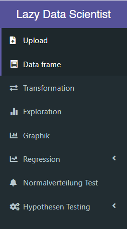

## Datensatz

Für die Erklärung des Programms ``Lazy Data Scientist`` und reproduzierbare Ergbnisse wird ein Titanic Datensatz verwendet (Kaggle). Dieser Datensatz besteht in Form einer .csv-Datei und wird im Github Repo bereitgestellt.  

## Upload

Der erste Tab ``Upload`` umfasst die grafische Oberfläche, mit welcher man den .csv-Datensatz hochladen kann. Der erste Knopf ``Browse...`` öffnet den Explorer und lässt den User eine Datei auswählen. 

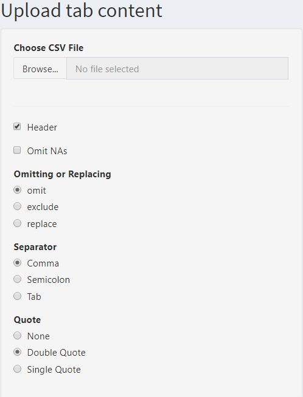

Weiters kann man zusätzliche Einstellungen anpassen, wie man oben sehen kann. ``Omit NAs`` kann essentiell sein, bei Daten mit Variablen, welche über leere Stellen verfügen. Hier muss man aufpassen, dass es nicht zu viele leere Stellen gibt. Es werden nämlich alle Zeilen mit mind. 1 leeren Stelle gelöscht. Dies kann zu einem Problem führen, wenn eine Variable häufig leere Stellen aufweist. Nachdem man den Datensatz hochgeladen hat, wird auf derselben Seite der Inhalt des Datensatzes in Tabellenform angezeigt. Die ersten 3 Einträge sind in folgendem Screenshot zu sehen. 

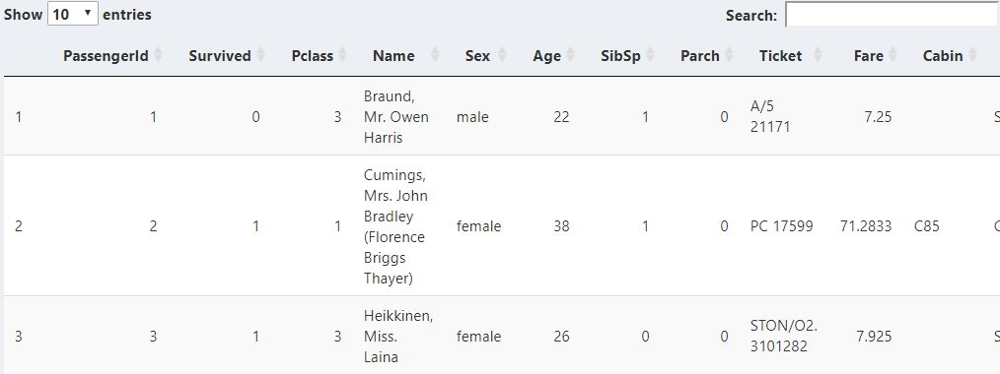

## Data Frame

Im nächsten Tab ``Data frame`` kann man sich die Struktur und Summary des Datensatzes ansehen.

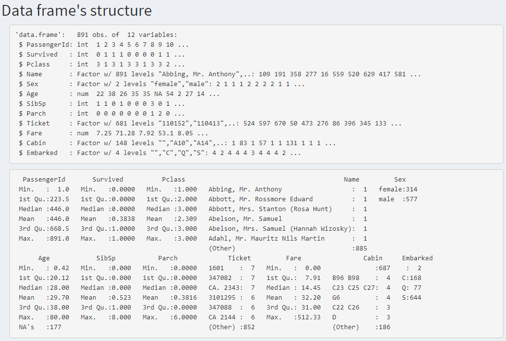

### Structure

Die data frame structure gibt Auskunft über die Variablen und Beobachtungen. In der ersten Zeile wird die Anzahl der Beobachtungen und Variablen angegeben. Danach wird jede Variable aufgelistet. Dazu kommen Informationen über den Namen, Variablentyp, und die ersten Werte. Bei Factor-Variablen wird die Anzahl der Levels angegeben. Dies gibt einfach an, wie viele verschiedene Kategorien bestehen. Zum Beispiel gibt es zwei Kategorien / Levels bei der Variable ``Sex``, nämlich ``male`` und ``female``. Diese Werte können mehrmals vorkommen, aber keine anderen. 

### Summary

Die data frame summary gibt zu jeder Variable verschiedene Daten an, entsprechend zum Variablentyp. Dazu gehören bei numerischen: Minimum, Erstes Quartil, Median, Mean / Arithmetischer Mittelwert, Drittes Quartil, Maximum.

Bei Faktorvariablen, werden die Levels aufgelistet und dessen Häufigkeit.

## Filterung

Der dritte Tab ``Filterung`` bietet die Funktion den Datensatz zu ändern. Dazu wird das Package ``dplyr`` verwendet. Vorkenntnisse in ``dyplr`` sind zu empfehlen, werden aber nicht unbedingt benötigt. Jedes Textfeld enthält nämlich eine kurze Textbeschreibung der Funktion und ein Beispiel. 

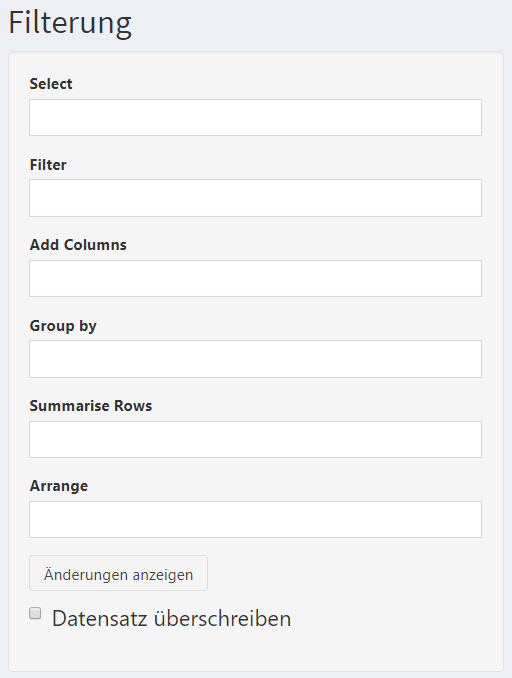

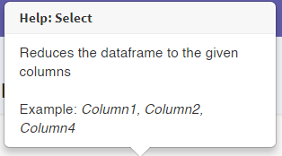

Das erste Textfeld beschreibt die Selektierung aller nötigen Variablen. Wenn man damit zufrieden ist, klickt man auf den Button ``Änderungen anzeigen``. Der neue Datensatz wird nun angezeigt. Wenn man mit dem neuen Datensatz zufrieden ist, kann man auf die Checkbox ``Datensatz überschreiben``  klicken. Diese überschreibt den alten Datensatz mit der neuen Version. Man braucht sich hier keine Sorgen, über die .csv-Datei machen. Diese bleibt verschont. Bloß der Datensatz im Programm wird geändert. Wenn man die Änderungen rückgängig machen möchte, kann man das Programm neu laden und die .csv-Datei hochladen.

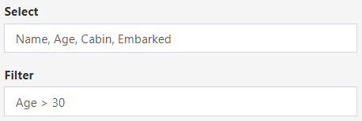

Die ersten drei Ergebnisse werden im folgenden Screenshot angezeigt.

## Exploration

Im Tab ``Exploration`` können Variablen des Datensatzes ausgewählt werden und genauer analysiert werden. Hierzu wird ein Drag&Drop-Menü mit den entsprechenden Variablen generiert. 

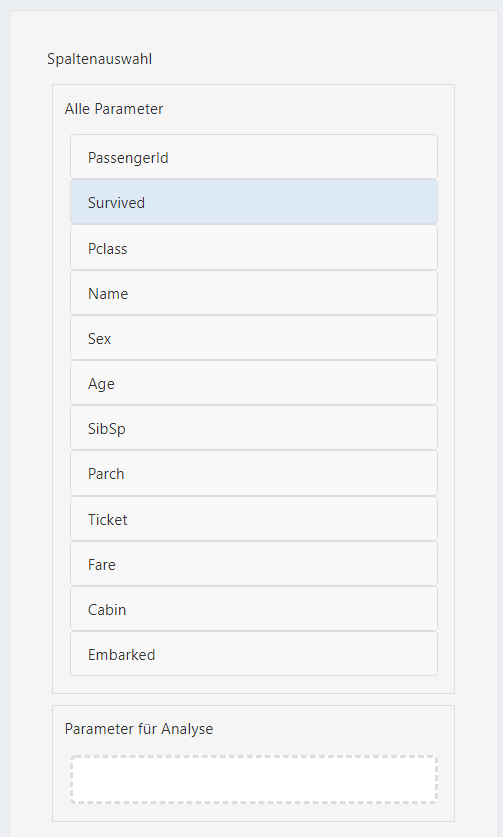

Nachdem man die (numerischen) Variablen ausgewählt hat, tickt man die gewünschten Checkboxes für die Exploration an.

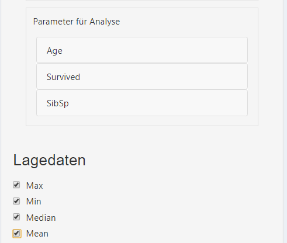

Daraufhin werden zwei Tabellen mit den Daten erstellt. Die zweite Tabelle zeigt den Code an, um diese Daten zu erhalten. Der Code wird jedoch so eine Tabelle nicht erstellen. Wie dies verläuft, kann man im Programm-Code nachsehen.

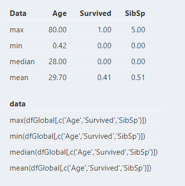

Anschließend gibt es hier noch ein Gif, welches den Prozess vorführt.

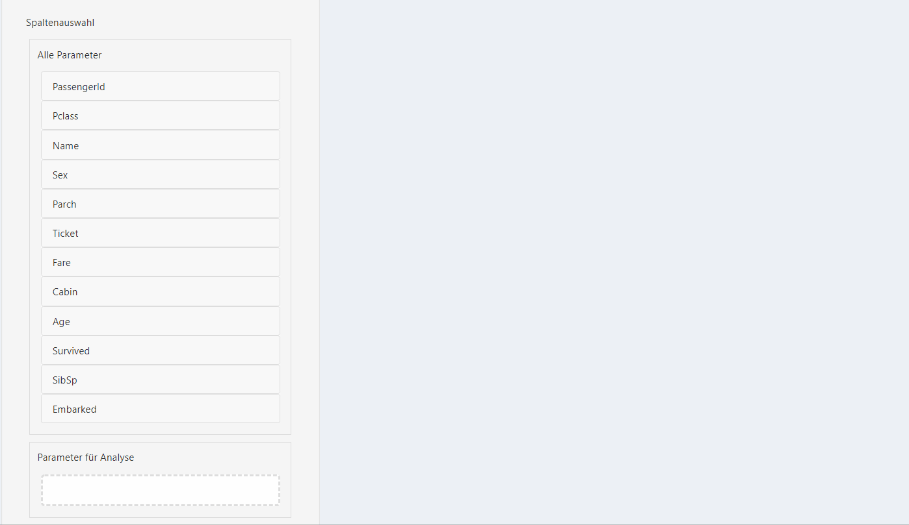

## Graphik

Im Graphik-Tab besteht ein Drag&Drop-Menü für die Bestimmung von Grafikeinstellungen. Die Variablen kann man auswählen, um die Achsen zu bestimmen. Mit den Colors können die Werte nach Kategorien farblich eingeteilt werden. Das heißt hier empfiehlt es sich, kategoriale Variablen (factor) zu verwenden. Das letzte Drop-Menü ist dafür Grafiken nach Kategorien zu trennen und mehrere Grafikfenster zu erstellen.

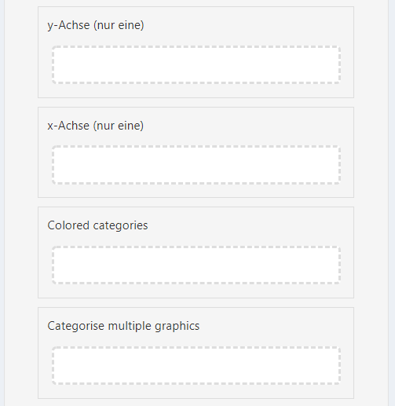

Hier kann man mittels Checkboxes die Grafiken bestimmen. Diese werden dann erstellt, anhand der vorigen Einstellungen. Unten kann man bestimmen, ob die Achsen logarithmisch skaliert werden sollen.

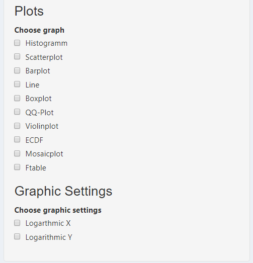

Hier ist ein Beispiel für ein Histogram. Die Variable ``Age`` muss in die y-Achse gezogen werden, weil es die einzige notwendige ist. Zusätzlich gibt es eine Beschreibung vom Plot und unter der Grafik befindet sich der Code für dieses Diagramm.

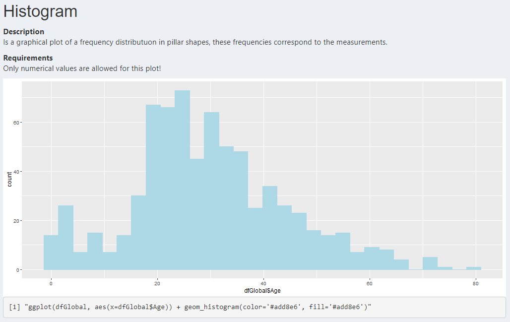

## Regression

## Normalverteilung Test

## Hypothesen Testing

